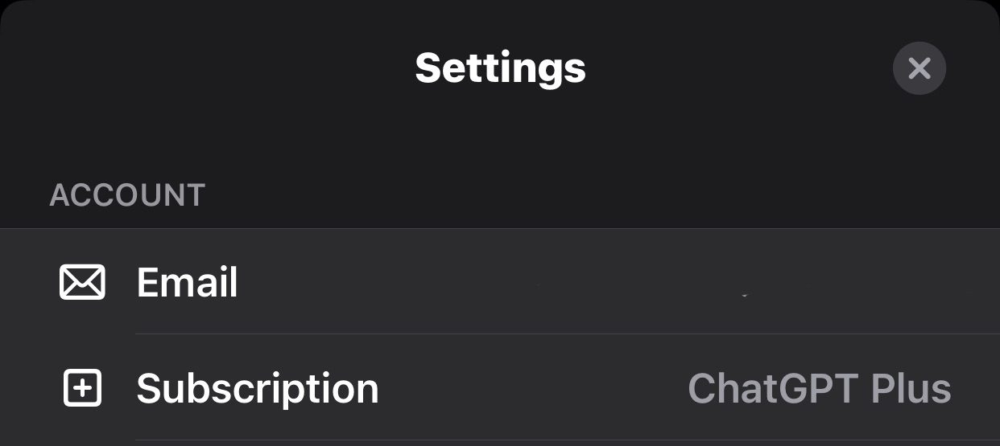
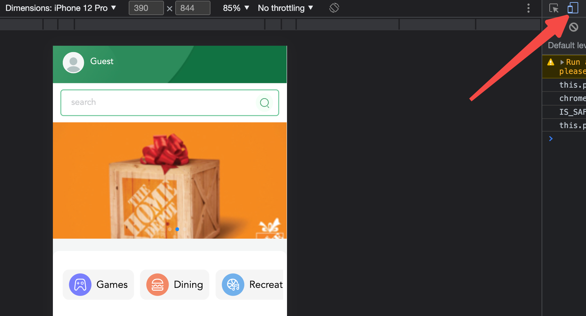
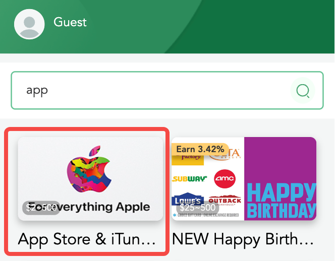
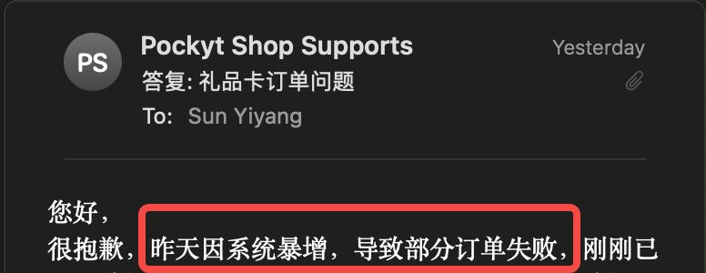
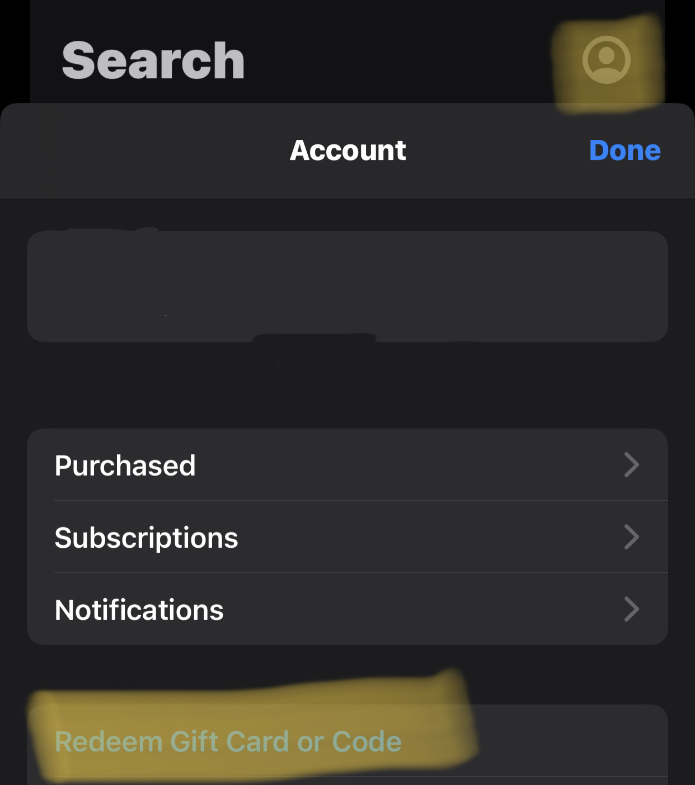

# 使用人民币完成 ChatGPT Plus 订阅支付

> 本文部分内容使用 Copilot 生成。

**目录**

[[toc]]

## 引言

之前为了订阅 ChatGPT Plus 颇费周章。曾经尝试过使用 Depay 虚拟 Master Card，一直遇到“卡片被禁用”的问题，未能支付成功。由于本人也没有国内/外的实体信用卡，一直没能完成 ChatGPT Plus 的订阅。

前两天，OpenAI 官方发布了 iOS 端 App，可以通过 Apple pay 完成支付。几经周折，终于尝到了快凉了的黄花菜。

不用信用卡，不需要兑换虚拟货币或外币，使用支付宝就能完成订阅支付，把这种方法分享给大家，一起分享使用 GPT4 的喜悦。

## 准备工作

1. iPhone（或许 iPad 也可以，我没有尝试过，如果有朋友尝试可以，欢迎留言分享）
2. 美区 Apple ID
3. 支付宝/微信
4. 其他（下载好的 ChatGPT App、上网工具、邮箱等）

## 购买美区 App Store & iTunes 礼品卡

首先，我们需要购买美区 App Store & iTunes 礼品卡，这里推荐使用 [Pockyt.io](https://shop.pockyt.io/)，这是一家专门提供礼品卡购买的网站，支持支付宝、微信支付。

> 推荐使用 Chrome 浏览器 `Toggle device toolbar` 功能，提升网站可阅读性。
>
> 

进入网站，搜索“App Store & iTunes US”，输入礼品卡金额，点击“购买”。

这里需要注册/登陆 Pockyt 网站，如遇注册/登录失败，可以邮件联系 Pockyt，他们回复的速度还比较快。

> 不知道是不是因为国内太多人使用礼品卡充值 App Store 购买 ChatGPT Plus，我当时用的时候系统巨崩。

支付时可以选择使用微信 or 支付宝。

支付完成后，一般 5 分钟内会把兑换码发到邮箱。

如果遇到订单失败，别担心，重新下单即可，之前的订单已支付金额会原路返还。

## 礼品卡充值到 Apple ID

打开 iPhone 上的 App Store，确保此时 App Store 登录的是美区的 Apple ID。

> 这里有一个我在用的小技巧，把国区和美区 ID 的账号密码存在 Apple 钥匙串里，方便切换。

点击右上角小人图标，在弹出的菜单里选择 **Redeem Gift Card or Code**（我猜中文是“兑换礼品卡或兑换码”）。

然后输入邮箱/订单里的礼品卡号码，即可完成兑换。

## 使用 Apple Pay 完成订阅

进入 ChatGPT App，在 **设置** - **订阅** 中，按照提示一步一步操作即可。

最终付款时不用管 Paypal 和信用卡，选择使用余额支付。

我猜每个月续费之前，保证 Apple ID 里有充足的余额供抵扣即可，前两天刚刚开通成功，等下个月续费时试一下。
