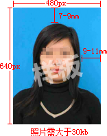
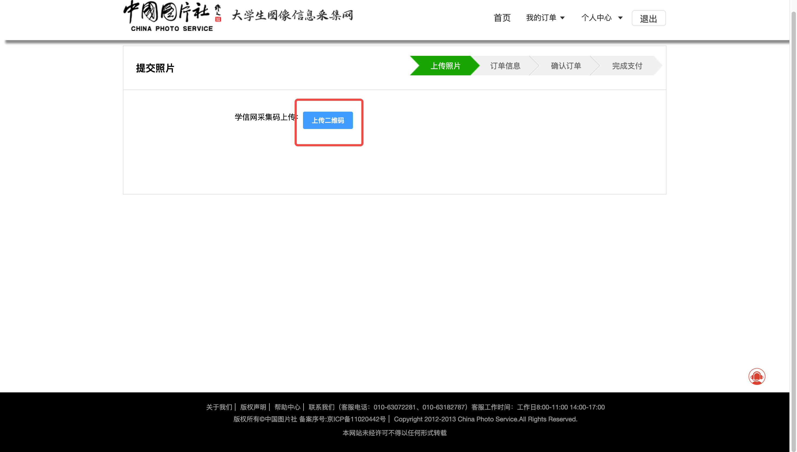
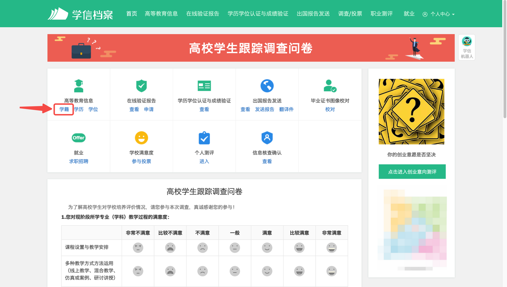
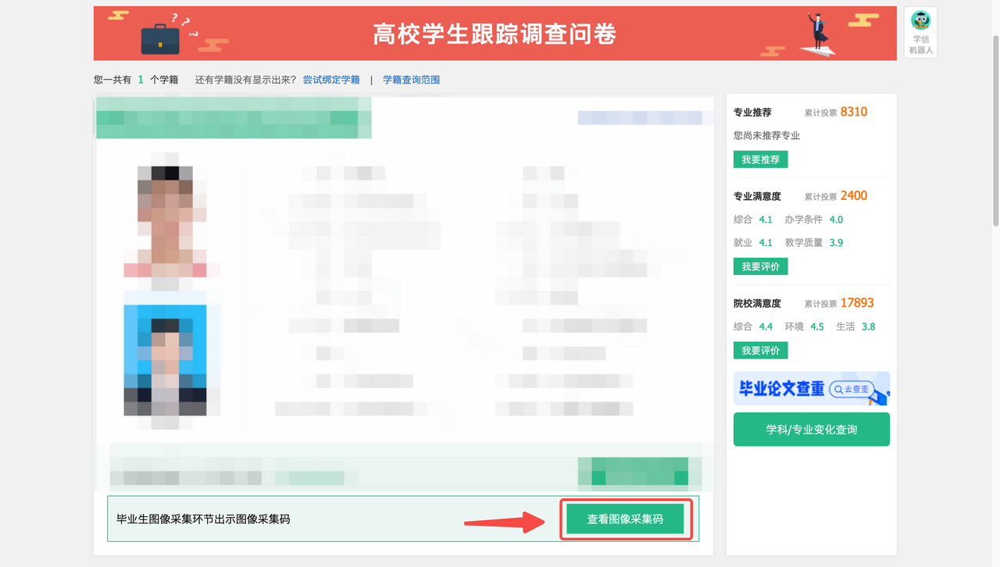
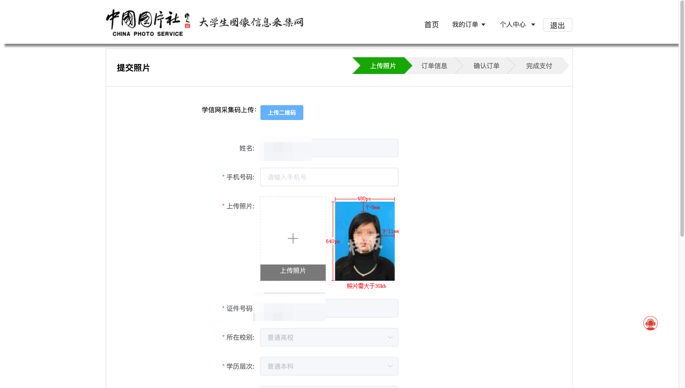

# 如何拥有拿得出手的学信网毕业照片

> 本文部分内容来自于 ChatGPT & Copilot。

[[toc]]

## 前言

嗨，亲爱的毕业生！你准备好了吗？是时候展示你的学历，向世界证明你的成就了！学信网是我们进入职场、深造和出国留学的通行证，所以确保你的毕业照片在学信网上亮相是至关重要的。

学校每年会组织进行学信网毕业照采集，这张照片同时会用于我们的毕业证上。这种集体拍摄的质量和效果，相信大家心里都有一个正确的预期。那么如何避免毕业照片变成“出狱照片”呢？当然是选择不参加集体采集，自己单独上传啦！

## 准备工作

1. 自己满意的证件照电子版
2. 学信网采集码
3. Photoshop（或其他能够精确裁剪、压缩照片的软件）

## 证件照拍摄

俺了解的比较出名的拍摄机构有两个，一个是【海马体】，另一个是【天真蓝】。

在网上了解了一番，普遍评价是海马体修图后有点不像自己，天真蓝拍出来比较真实且好看。

所以俺选择的是【天真蓝】。

可以在微信小程序上预约拍摄日期，俺去的是【万象城】的天真蓝店，出地铁就是商场，天真蓝就在那一层。

套餐一百多，带化妆、发型、挑衣服、拍摄、修图。

**拍摄建议：**

- 如果有自己的化妆品，可以带上用自己的，俺男生无所谓，用他们的也可以
- 可能会修眉毛，如果谨慎的话，可以提出用自己的修眉刀，如果没有自己的，还是看着他们多用酒精消消毒
- 去之前洗头，方便做造型，头发看起来也不会油
- 衣服有西装和绒毛背心学院服可选，如果选西装，建议搭配一条【可爱/活泼】一点的领带
- 如果近视，建议佩戴【隐形眼镜/美瞳】（因为实体镜片眼镜会反光，拍照不能戴），俺当时就是没有戴隐形，拍出来眼睛无神（还好后期老师 🐮）
  - 推荐俺在用的日抛，【强生安视优舒日】，佩戴没有异物感，价格也能接受
- 拍摄完成后，可以在万象城逛逛，一般当天（几个小时）就能修好图，手机会收到提醒，确认修图符合你意后，可以线上确认，不和心意的还可以继续沟通
- 确认图片后，记得【保存原图】、一寸裁切、二寸裁切版，天真蓝图片【过期后无法下载】
- 如果可以的话，原图多【备份】几份，理由同上
- 选择拍【白色】背景色，后期可以通过 PS 换成其他底色的证件照，并且白色底色适合于放在简历、工牌等上

## 面向学信网裁切证件照

这个就是学信网照片要求，背景色参考值 （R: 100, G: 197, B: 255）。

裁切时要注意头顶距顶部的距离，以及脸侧距侧边的距离。

照片换底色教程俺参考的这一篇 👉 https://zhuanlan.zhihu.com/p/97560952

## 上传照片

在俺自主上传成功之前，听到的消息都是“需要统一拍摄或去新华社补拍，自己拍的没法上传”。但当时俺身在十八线小城市，去新华社补拍路途遥远、费时费力，懒惰之下，找到了这个网站（https://www.xinhuacu.com/#/home）。

首先点击右上角【登录/注册】，然后点击页面中央的【线上散拍】，在下一个页面点击【上传二维码】。

这里的二维码需要在【学信网】获取，具体位置为【学信网-学籍】。

将保存的采集码上传到新华社的网站，就可以进入下一页。核对个人信息并完成关键信息填写、照片上传即可。
这里【证件号码】可能显示为身份证号后四位，属于正常情况。

完成这一步后，无脑下一步，最后确认纸质版照片收货地址，并且完成缴费即可。

过大概 7 个工作日，上学信网看【毕业照片校对】，就能看到上传成功的毕业照片了。

## 如果你已经参加了集中采集……

如果你对目前的采集结果不是很满意，并且看到这篇文章比较早，俺的建议是按照上述方法，重新上传照片。试试看能不能把当前的照片【冲掉】。

需要注意的是，学信网的毕业照片和你交给学校的纸质版照片必须一致，否则会有问题。

如果能成功，那之前集中采集的钱就当买了个教训吧～

## 结语

最后，恭喜你！你已成功上传拿得出手的学信网毕业照片。现在，你可以自豪地展示你的学历，并且为未来的职业发展铺平道路。

记住，这只是一个简单的教程，帮助你上传学信网毕业照片。如果你有特殊要求或遇到困难，建议你查阅学信网的官方指南或联系他们的客服团队，寻求进一步的帮助。

祝愿你成功地上传令你满意的学信网毕业照片，开启美好的职业和深造生涯！加油！

## 参考资料

1. [如何自主提交学信网照片](https://zhuanlan.zhihu.com/p/571779092)
2. [PS如何给证件照换底色？](https://zhuanlan.zhihu.com/p/97560952)
